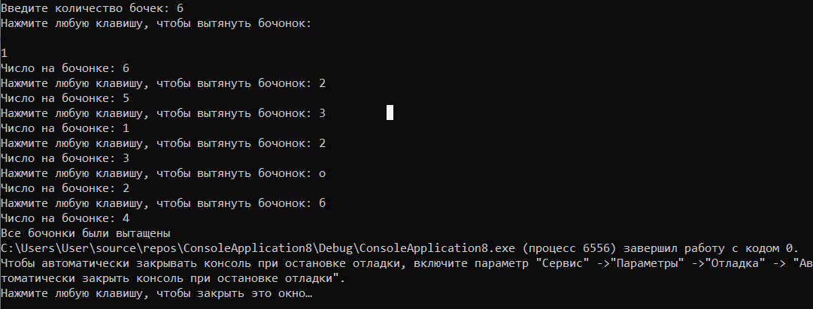

# bochonki

## программа для проведения жеребьевки методом генерации случайных чисел.

В мешке с бочонками N бочек (от 1 до N).

Нажатие кнопки – вытаскивание очередного бочонка из мешка.

Вытянутые бочонки убираем в сторону

Приложение было раздаботано в среде Microsoft Visual Studio Community 2019. Поэтому самый удобный запуск его будет осуществлён именно там. Для открытия проекта необходимо открыть файл *.sln в корне репозитория.

При запуске программы мы видим консоль, которая просит ввести количество бочонков, далее при нажатии любой клавиши + enter программа будет показывать номера выпавших бочонков до тех пор, пока они не закончатся

